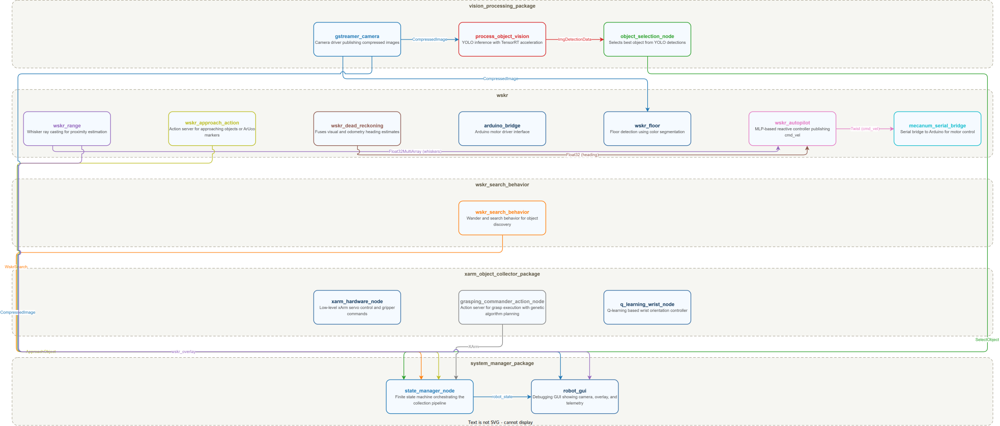
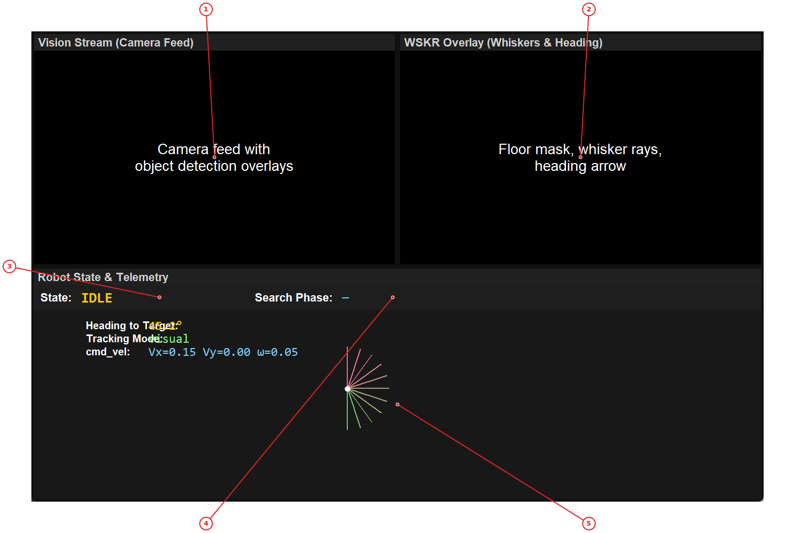
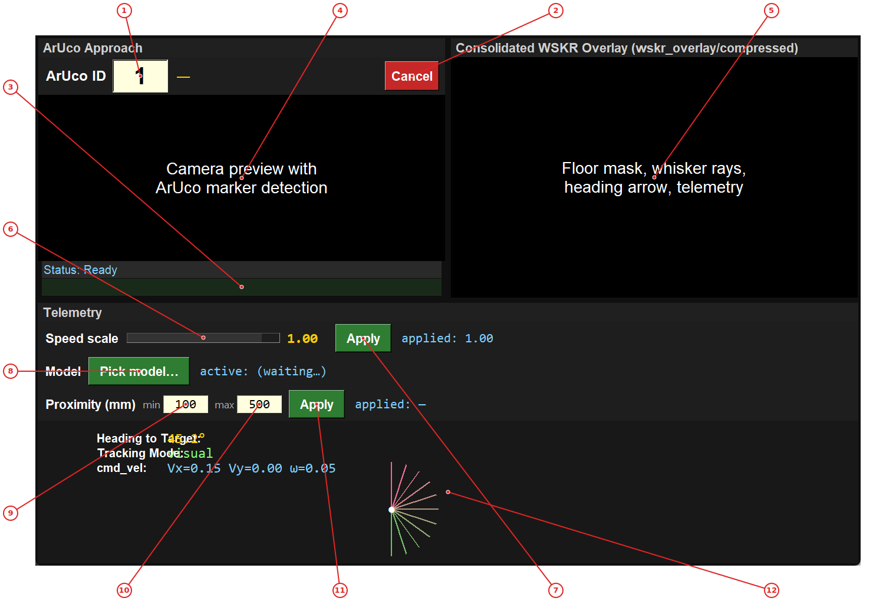

# UofI Hand-Built Robot

The UofI Hand-Built Robot is a ROS 2-based autonomous robot system built by students at the University of Illinois. The robot uses a mecanum-wheel drive base for omnidirectional movement, a fisheye camera for computer vision, and a 5-DOF xArm manipulator for picking up objects.

The system is controlled by a finite state machine (FSM) that orchestrates the entire object collection pipeline: searching for objects, selecting the best target, approaching it, grasping it with the arm, finding the drop box, and delivering the object. The vision system uses YOLO with TensorRT inference to detect objects, while the navigation system uses a novel "whisker" proximity sensing approach that casts virtual rays to estimate distances to objects.

The project is designed for student learning and experimentation. It includes multiple debugging GUIs, tuning tools, and supports the Foxglove visualization platform for remote monitoring. The entire system runs on an NVIDIA Jetson computer mounted on the robot, making it a fully autonomous platform.

## What You Need to Do

Before the robot system will work end-to-end, there are several components you must complete or configure with your own trained models and tuned parameters. This section summarizes what is provided as scaffolding and what you are responsible for.

### Replace Placeholder Files

All configuration files, model weights, and calibration data that you need to supply are marked with a `your_*` prefix. These are intentionally left empty or filled with dummy values. You must replace each one with the real output from your tuning and training work:

| Placeholder File | Location | What to Replace It With |
|------------------|----------|------------------------|
| `your_floor_params.yaml` | `src/wskr/config/` | Your tuned floor detection parameters (from the Floor Tuner) |
| `your_lens_params.yaml` | `src/wskr/config/` | Your calibrated lens/camera parameters (from the Heading Tuner) |
| `your_Whisker_Calibration.json` | `src/wskr/config/` | Your whisker ray-casting calibration data (from the whisker calibration procedure) |
| `your_MLP_model_here.json` | `src/wskr/wskr/models/` | Your trained MLP autopilot model |
| `your_vision_model_here.pt` | `src/vision_processing_package/models/` | Your trained YOLO/Roboflow object detection model |
| `your_q_table_here.csv` | `src/xarm_object_collector_package/data/` | Your Q-table for the xArm (if applicable) |

After replacing a file, update the corresponding filename constants in `constants.py` so the system loads your files instead of the placeholders.

### Complete the State Machine and Search Behavior

The nodes in the `system_manager_package` have been **scaffolded but are not complete**. Specifically, `state_manager.py` and `search_supervisor.py` (in `src/system_manager_package/src/`) contain detailed docstrings, suggested state definitions, and mini-tutorials, but the implementation is up to you. You are responsible for:

- Implementing the finite state machine in `state_manager.py` that orchestrates the full collection pipeline (search, select, approach, grasp, find box, approach box, drop, repeat).
- Implementing the search behavior in `search_supervisor.py` that controls how the robot wanders and detects targets.

Read the docstrings at the top of each file carefully — they describe the available ROS interfaces, suggested states, and patterns you should follow.

### Transcribe Your Genetic Algorithm Parameters

After running your genetic algorithm experiments, you must transcribe your optimized GA parameters into `constants.py` (located at `src/system_manager_package/system_manager_package/constants.py`). Look for the GA parameter block (the constants prefixed with `GA_`) and update the values to match your results — including population size, mutation rate, selection method, fitness weights, and any other parameters you tuned.

If you modified the cost/fitness function during your GA experiments, you must also transcribe those changes into the `GeneAlgo` class in `src/xarm_object_collector_package/src/genetic_algorithm.py`. The relevant method is `_compute_reward()`.

---

## Getting Started

1. Set up your ROS 2 workspace by sourcing the setup file:
   ```bash
   source /opt/ros/humble/setup.bash
   ```

2. Build the workspace:
   ```bash
   cd ~/Project6/Project6_Class_Distro
   colcon build --symlink-install
   ```

3. Source the workspace:
   ```bash
   source install/setup.bash
   ```

4. Launch the full system with GUI:
   ```bash
   ros2 launch system_manager_package robot_bringup.launch.py launch_gui:=true
   ```

You should see the Robot State GUI appear showing the camera feed, WSKR overlay, and current robot state. The robot is now ready to accept commands.

## Installation

## System Requirements

- **Operating System**: Ubuntu 22.04
- **ROS 2 Distribution**: Humble Hawksbill
- **Python**: 3.10 or later
- **Hardware**: NVIDIA Jetson (Orin, Xavier, or Nano) with GPU support
- **Camera**: USB camera supporting MJPEG at 1920x1080@30fps
- **Arduino**: Arduino-compatible board for motor control

## ROS 2 Installation

### Ubuntu 22.04

```bash
# Install ROS 2 Humble
sudo apt update
sudo apt install ros-humble-desktop-full

# Install additional packages
sudo apt install python3-pip python3-venv
pip3 install opencv-python-headless numpy pillow

# Source ROS 2
source /opt/ros/humble/setup.bash
```

## Building the Workspace

```bash
# Navigate to the project root
cd ~/Project6/Project6_Class_Distro

# Build with colcon
colcon build --symlink-install

# Source the workspace
source install/setup.bash
```

## Foxglove Dashboard

The Foxglove dashboard provides remote monitoring and control of the robot from any computer on the LAN. It runs in a web browser — nothing needs to be installed on the Jetson besides the ROS 2 bridge package.

Pre-built files are provided in `foxglove_files/`:
- `wskr.wskr-panels-0.1.0.foxe` — custom panel extension (drag into Foxglove once per viewer)
- `HBR_COMMAND_DASHBOARD.json` — three-tab layout (Robot Dashboard, Diagnostics, Manual Control)

### Jetson Setup (one-time)

Install the bridge and topic throttle packages:

```bash
sudo apt update
sudo apt install ros-humble-foxglove-bridge ros-humble-topic-tools
```

Rebuild the workspace so the foxglove launch file is installed:

```bash
cd ~/Project6/Project6_Class_Distro
colcon build --symlink-install
source install/setup.bash
```

If `ufw` is enabled, open the WebSocket port:

```bash
sudo ufw allow 8765/tcp
```

### Launching (Jetson)

Two terminals, both sourced. The robot stack runs as usual; the Foxglove bridge runs alongside it.

**Terminal A — robot stack:**

```bash
ros2 launch system_manager_package robot_bringup.launch.py
```

**Terminal B — Foxglove bridge + helpers:**

```bash
ros2 launch utilities wskr_foxglove.launch.py
```

You should see `[foxglove_bridge] Listening on 0.0.0.0:8765`.

The bridge throttles camera and overlay images independently of the full-rate feeds used by vision nodes. Override with:

```bash
ros2 launch utilities wskr_foxglove.launch.py bridge_camera_rate_hz:=4.0 bridge_overlay_rate_hz:=10.0
```

Find the Jetson's IP for the next step:

```bash
hostname -I
```

### Client Setup (laptop / any computer on the LAN)

**1. Open Foxglove** — pick any one of these:

| Method | How |
|--------|-----|
| Web app (easiest, needs internet) | Open [app.foxglove.dev](https://app.foxglove.dev) in a browser — no install, no sudo |
| Desktop app (.deb) | Download the `.deb` from [foxglove.dev/download](https://foxglove.dev/download). No sudo required — extract with `dpkg -x FoxgloveStudio-*.deb ~/foxglove` and run `~/foxglove/opt/Foxglove\ Studio/foxglove-studio` |
| Desktop app (AppImage) | Download the `.AppImage` from the same page. `chmod +x` and run directly — no install needed |

**2. Connect to the Jetson:**

Click **Open connection** and enter `ws://<jetson-ip>:8765`. Topics should appear in the left sidebar.

**3. Install the custom panel extension** (first time per viewer):

Drag `foxglove_files/wskr.wskr-panels-0.1.0.foxe` into the Foxglove window. A toast confirms the extension loaded. If nothing happens, use the menu: **⋮ → Extensions → Install extension…** and pick the file from disk.

**4. Import the dashboard layout:**

> **Order matters.** Install the `.foxe` extension (step 3) *before* importing the layout. If you import first, Foxglove marks custom panels as "unknown" and strips their settings.

Click the **Layout** dropdown (top-left) → **Import from file…** → select `foxglove_files/HBR_COMMAND_DASHBOARD.json`.

The layout has three tabs:

| Tab | Contents |
|-----|----------|
| **Robot Dashboard** | Whisker fan, camera+ArUco overlay, cmd_vel plot, robot state, autopilot panel, speed taper, toy approach |
| **Diagnostics** | ROS parameters, state transition timeline, topic graph, rosout log viewer |
| **Manual Control** | cmd_vel/heading/whisker plots, whisker fan, camera feed, teleop pad, STOP button |

### Rebuilding the Extension (optional)

The `.foxe` in `foxglove_files/` is pre-built. To rebuild after modifying panel source code:

```bash
cd src/utilities/foxglove_extensions/wskr_panels
npm install       # first time only
npm run package
```

This produces a new `wskr.wskr-panels-X.X.X.foxe`. Copy it to `foxglove_files/` and redistribute to viewers.

### Troubleshooting Foxglove

| Symptom | Fix |
|---------|-----|
| WebSocket connection fails | Verify Terminal B shows `Listening on 0.0.0.0:8765`. Test with `nc -zv <jetson-ip> 8765` from the laptop. Check `sudo ufw status`. |
| Panels show but no data | Reload Foxglove's connection (arrow icon). Confirm topics are flowing: `ros2 topic list` and `ros2 topic hz /camera1/image_raw/compressed` on the Jetson. |
| Custom panels say "unknown" | You imported the layout before installing the `.foxe`. Delete the layout, install the extension, then re-import. |
| Camera panel is black | Bridge throttles camera to 2 Hz by default. Wait a few seconds, or increase `bridge_camera_rate_hz`. |
| High Jetson CPU from Foxglove | Lower throttle rates. All rendering (ArUco detection, whisker fan drawing) happens in the viewer's browser, not on the Jetson. |

## Dependencies

Install Python dependencies:

```bash
pip install -r requirements.txt
```

Key dependencies include:
- `opencv-python`: Computer vision operations
- `numpy`: Numerical computations
- `pillow`: Image processing
- `tensorrt`: GPU-accelerated inference (Jetson only)
- `ultralytics`: YOLO model inference

## Project Structure

The project is organized as a ROS 2 workspace with multiple packages in the `src/` directory:

```
Project6_Class_Distro/
├── src/
│   ├── arduino/                      # Arduino serial bridge for motor control
│   │   ├── arduino/
│   │   │   └── mecanum_serial_bridge.py
│   │   └── launch/
│   │       └── arduino.launch.py
│   │
│   ├── gstreamer_camera/             # Camera driver using GStreamer
│   │   ├── gstreamer_camera/
│   │   │   └── gst_cam_node.py
│   │   └── launch/
│   │       └── gstreamer_camera.launch.py
│   │
│   ├── system_manager_package/       # Central FSM, search behavior, and GUI
│   │   ├── gui/
│   │   │   └── robot_gui.py          # Main debugging GUI
│   │   ├── src/
│   │   │   ├── state_manager.py      # Finite state machine (scaffolded — you complete this)
│   │   │   └── search_supervisor.py  # Search behavior (scaffolded — you complete this)
│   │   ├── system_manager_package/
│   │   │   └── constants.py          # All tunable parameters
│   │   └── launch/
│   │       ├── robot_bringup.launch.py
│   │       └── sys_manager.launch.py
│   │
│   ├── wskr/                         # Whisker-based navigation
│   │   ├── config/
│   │   │   ├── your_floor_params.yaml        # Replace with your tuned floor params
│   │   │   ├── your_lens_params.yaml         # Replace with your calibrated lens params
│   │   │   └── your_Whisker_Calibration.json # Replace with your whisker calibration
│   │   ├── wskr/
│   │   │   ├── wskr_autopilot.py     # MLP-based reactive controller
│   │   │   ├── approach_action_server.py
│   │   │   ├── wskr_floor_node.py    # Floor detection
│   │   │   ├── wskr_range_node.py    # Whisker ray casting
│   │   │   ├── dead_reckoning_node.py
│   │   │   └── models/
│   │   │       └── your_MLP_model_here.json  # Replace with your trained MLP model
│   │   └── launch/
│   │       └── wskr.launch.py
│   │
│   ├── vision_processing_package/    # YOLO inference and object selection
│   │   ├── models/
│   │   │   └── your_vision_model_here.pt     # Replace with your YOLO/Roboflow model
│   │   ├── src/
│   │   │   ├── process_object_vision.py
│   │   │   ├── object_selection.py
│   │   │   └── bbox_to_xyz_service_2D.py
│   │   └── launch/
│   │       └── vision_processing.launch.py
│   │
│   ├── xarm_object_collector_package/ # xArm manipulator control
│   │   ├── data/
│   │   │   └── your_q_table_here.csv         # Replace with your Q-table (if applicable)
│   │   ├── src/
│   │   │   ├── xarm_hardware_node.py
│   │   │   ├── Object_collector_action_server.py
│   │   │   ├── genetic_algorithm.py  # GeneAlgo class — update if you changed the cost function
│   │   │   └── controller_class.py
│   │   └── launch/
│   │       └── xarm_object_collector_ga.launch.py
│   │
│   ├── utilities/                    # Debugging and tuning tools
│   │   ├── utilities/
│   │   │   ├── wskr_dashboard.py     # Combined control dashboard
│   │   │   ├── floor_tuner.py        # Floor detection tuner
│   │   │   ├── heading_tuner.py      # Heading estimation tuner
│   │   │   ├── mecanum_teleop.py     # Manual teleoperation
│   │   │   └── robot_control_panel.py
│   │   └── launch/
│   │       └── wskr_foxglove.launch.py
│   │
│   └── robot_interfaces/             # Custom ROS 2 message/action definitions
│
├── foxglove_files/                   # Foxglove dashboard layouts
│   └── HBR_COMMAND_DASHBOARD.json
│
└── docs/                             # Documentation
```

### Package Summary

| Package | Purpose |
|---------|---------|
| `arduino` | Serial communication with Arduino motor controller |
| `gstreamer_camera` | Camera driver publishing compressed images |
| `system_manager_package` | FSM orchestrator, search behavior, and debugging GUI |
| `wskr` | Whisker-based proximity sensing and autopilot |
| `vision_processing_package` | YOLO object detection and selection |
| `xarm_object_collector_package` | xArm manipulator control with GA planning |
| `utilities` | Development and debugging tools |
| `robot_interfaces` | Custom ROS 2 message and action definitions |

## robot_bringup.launch.py — Full System Architecture

This diagram shows the complete node graph when running `robot_bringup.launch.py`. The launch file includes four sub-launch files: sys_manager.launch.py (state manager), xarm_object_collector_ga.launch.py (xArm control), wskr.launch.py (navigation), and search_behavior.launch.py (search behavior). Each node is grouped by its package. Topics flow between nodes for sensor data, commands, and status updates.



*All ROS 2 nodes launched by robot_bringup.launch.py, grouped by package. Topics connect nodes for data flow.*

## Core Concepts

## The Finite State Machine (FSM)

The robot's behavior is controlled by a **Finite State Machine** implemented in `state_manager.py`. The FSM manages the entire object collection pipeline through a series of states:

```
IDLE ──(command)──► SEARCH ──► SELECT ──► APPROACH_OBJ ──► GRASP
                       ▲                                      │
                       │                                      ▼
                       │                                   FIND_BOX
                       │                                      │
                       │                                      ▼
                       ◄────────── DROP ◄────────── APPROACH_BOX
```

### State Descriptions

| State | Purpose | Next State |
|-------|---------|------------|
| **IDLE** | Robot is stationary, waiting for commands | SEARCH (on command) |
| **SEARCH** | Wander while looking for objects using YOLO | SELECT (object found) |
| **SELECT** | Pick the best object from current detections | APPROACH_OBJ |
| **APPROACH_OBJ** | Drive toward the selected object | GRASP (proximity reached) |
| **GRASP** | Pick up object with xArm | FIND_BOX (success) |
| **FIND_BOX** | Wander while looking for ArUco marker on drop box | APPROACH_BOX |
| **APPROACH_BOX** | Drive toward the drop box | DROP (proximity reached) |
| **DROP** | Open gripper to release object | SEARCH (loop continues) |
| **STOPPED** | Emergency stop - ignores most commands | IDLE (on "idle" command) |
| **ERROR** | Error state - requires manual intervention | IDLE (on "idle" command) |

### How the FSM Works

1. **Commands**: Send state names to `/robot_command` topic (e.g., "search", "stop")
2. **Transitions**: Each state has a delay before its handler executes
3. **Actions**: States dispatch ROS 2 action goals to subsystems (search, approach, grasp)
4. **Feedback**: Action feedback updates progress; results trigger next state
5. **Cancellation**: STOPPED/ERROR states cancel all in-flight actions

### Publishing Commands

```bash
# Start searching for objects
ros2 topic pub /robot_command std_msgs/msg/String "{data: 'search'}"

# Stop the robot
ros2 topic pub /robot_command std_msgs/msg/String "{data: 'stop'}"

# Return to idle
ros2 topic pub /robot_command std_msgs/msg/String "{data: 'idle'}"
```

## Whisker-Based Navigation

The WSKR (Whisker-based Sensorimotor Control for Robots) system uses a **fisheye camera** to estimate distances to objects:

1. **Floor Detection**: Identifies floor pixels using color segmentation
2. **Ray Casting**: Casts 11 virtual "whisker" rays across the camera's field of view
3. **Distance Estimation**: Measures distance to first non-floor pixel along each ray
4. **Proximity Sensing**: Provides 11 distance values (in mm) representing obstacles

The whisker system works like an insect's antennae - providing proximity information without requiring depth sensors.

## Dead Reckoning Fusion

The robot fuses two heading estimates:

- **Visual Heading**: Computed from bounding box position in camera frame
- **Odometry Heading**: Computed from wheel encoder data

When the visual heading becomes unreliable (object leaves camera view), the system switches to dead reckoning. When the object reappears, it switches back to visual tracking.

## Autopilot (MLP Controller)

The autopilot uses a **Multi-Layer Perceptron (MLP)** trained with reinforcement learning:

- **Input**: 11 whisker distances + 11 target whisker distances + 1 heading angle = 23 values
- **Output**: cmd_vel (linear x, linear y, angular z)
- **Training**: PPO (Proximal Policy Optimization) in simulation
- **Inference**: Runs at 10 Hz on the Jetson GPU

## Genetic Algorithm Trajectory Planning

The xArm uses a **Genetic Algorithm** to plan collision-free trajectories:

1. **Chromosome**: Sequence of joint actions (step size = 2°)
2. **Fitness**: Minimizes distance to goal + penalizes non-orthogonal approach
3. **Evolution**: 150 individuals × 100 generations
4. **Output**: Smooth joint trajectory for the 5-DOF arm

## Key Terminology

| Term | Definition |
|------|------------|
| **Whisker** | A virtual ray cast from the camera to estimate distance |
| **ArUco Marker** | A fiducial marker (like a QR code) used for precise localization |
| **YOLO** | "You Only Look Once" - a real-time object detection neural network |
| **TensorRT** | NVIDIA's GPU inference optimizer for fast neural network execution |
| **Dead Reckoning** | Estimating position from wheel encoder data |
| **Proximity** | Distance to nearest obstacle along a whisker ray |
| **Tracking Mode** | Either "visual" (using camera) or "dead_reckoning" (using odometry) |

---

## Full System Bringup and Autonomous Collection

Launch the complete robot system and begin autonomous object collection. This workflow starts all nodes including the state machine, vision system, navigation, xArm control, and search behavior.

### How to use

1. 1. Open a terminal and source your ROS 2 workspace:
   ```bash
   source /opt/ros/humble/setup.bash
   cd ~/Project6/Project6_Class_Distro
   source install/setup.bash
   ```

2. 2. Launch the full system with the debugging GUI:
   ```bash
   ros2 launch system_manager_package robot_bringup.launch.py launch_gui:=true
   ```
   Wait for all nodes to start (about 10-15 seconds). You should see console output from each node.

3. 3. The **Robot State GUI** will open showing:
   - **Vision Stream** (top-left): Live camera feed with object detection overlays
   - **WSKR Overlay** (top-right): Floor mask, whisker rays, and heading arrow
   - **State & Telemetry** (bottom): Current robot state, search phase, heading, and cmd_vel

4. 4. Verify the robot is in **IDLE** state (shown in yellow in the state display).

5. 5. Start the autonomous collection by publishing to the command topic:
   ```bash
   ros2 topic pub /robot_command std_msgs/msg/String "{data: 'search'}"
   ```

6. 6. Watch the state transitions in the GUI:
   - **SEARCH**: Robot wanders while looking for objects
   - **SELECT**: Object detected, selecting best target
   - **APPROACH_OBJ**: Driving toward the object
   - **GRASP**: xArm picking up the object
   - **FIND_BOX**: Searching for the drop box ArUco marker
   - **APPROACH_BOX**: Driving to the drop box
   - **DROP**: Releasing the object
   - **SEARCH**: Loop repeats for continuous collection

7. 7. Monitor the telemetry panel for:
   - **Heading to Target**: Current heading angle in degrees
   - **Tracking Mode**: 'visual' or 'dead_reckoning'
   - **cmd_vel**: Current velocity commands (Vx, Vy, ω)
   - **Whisker Fan**: Visual representation of proximity sensors

8. 8. To stop the robot at any time:
   ```bash
   ros2 topic pub /robot_command std_msgs/msg/String "{data: 'stop'}"
   ```

9. 9. To resume from stopped:
   ```bash
   ros2 topic pub /robot_command std_msgs/msg/String "{data: 'idle'}"
   ```


### Robot State GUI

Main debugging dashboard showing live camera feed, WSKR navigation overlay, and real-time robot telemetry.



**Labeled controls and displays:**

1. **Vision Stream panel** — Live camera feed with YOLO detection bounding boxes overlaid

2. **WSKR Overlay panel** — WSKR navigation overlay showing floor mask, whiskers, and heading

3. **Robot state display** — Current FSM state (IDLE, SEARCH, SELECT, APPROACH_OBJ, etc.)

4. **Search phase indicator** — Current search behavior phase (WANDER, LOOK, etc.)

5. **Telemetry canvas** — Numeric telemetry: heading, tracking mode, cmd_vel, whisker fan diagram

The **Robot State GUI** provides comprehensive debugging information for the autonomous collection pipeline. The **Vision Stream** panel (1) shows the live camera feed with YOLO detection bounding boxes overlaid in different colors. The **WSKR Overlay** panel (2) displays the floor detection mask, whisker proximity rays, heading arrow, and current tracking mode. The **State display** (3) shows the current FSM state (IDLE, SEARCH, SELECT, etc.) in yellow text. The **Search Phase** indicator (4) shows the current phase of the search behavior (WANDER, LOOK, etc.). The **Telemetry canvas** (5) at the bottom displays numeric values for heading to target, tracking mode, cmd_vel commands, and a visual whisker fan diagram showing proximity distances. Use this GUI to monitor robot behavior during autonomous operation and debug issues with vision, navigation, or state transitions.

---

## WSKR Dashboard for Manual Control and Debugging

Use the WSKR Dashboard for manual control and debugging of the approach behavior. This GUI provides direct control over ArUco approach, speed scaling, model selection, and proximity parameters.

### How to use

1. 1. Launch the WSKR Dashboard:
   ```bash
   ros2 run utilities wskr_dashboard
   ```
   The dashboard will open with three panels.

2. 2. **ArUco Approach Panel** (top-left):
   - Enter the ArUco marker ID in the entry field (1)
   - Click **Start Approach** (2) to begin approaching the marker
   - Monitor the **Status** label (3) for goal state updates
   - Watch the **Camera preview** (4) for live ArUco detection (yellow box = target marker)
   - Click **Cancel** to abort the approach

3. 3. **WSKR Overlay Panel** (top-right):
   - Shows the consolidated WSKR telemetry overlay
   - Displays floor mask (white = detected floor)
   - Shows whisker rays (colored lines = proximity distances)
   - Shows heading arrow and current tracking mode

4. 4. **Telemetry Panel** (bottom):
   - **Speed scale slider** (5): Adjust autopilot speed from 0.0 to 1.0
   - Click **Apply** (6) to send the new speed setting
   - **Pick model** button (7): Select a different neural network model file
   - **Proximity min/max** entries (8, 9): Set distance thresholds for speed attenuation
   - Click **Apply** (10) to update proximity parameters
   - **Telemetry canvas** (11): Shows heading, tracking mode, cmd_vel, and whisker fan diagram

5. 5. To approach a toy object instead of an ArUco marker:
   - Ensure the vision system is detecting objects (check YOLO output)
   - Click **Approach Toy** button
   - The robot will approach the object selected by object_selection_node

6. 6. Monitor the feedback labels:
   - **Approach status**: Shows current goal state (ACTIVE, SUCCESS, ABORTED, etc.)
   - **Feedback row**: Shows live tracking mode, heading, and closest whisker distance during approach

7. 7. Tune parameters in real-time:
   - Adjust speed scale to make the robot move slower/faster
   - Change proximity limits to control when the robot slows down near objects
   - Switch models to test different trained policies


### WSKR Dashboard

Combined control dashboard for ArUco approach, telemetry monitoring, and autopilot parameter tuning.



**Labeled controls and displays:**

1. **ArUco ID entry** — Enter the ArUco marker ID to approach (default: 1)

2. **Cancel button** — Cancel the current approach goal

3. **Approach status label** — Current approach goal state (Ready, Active, Success, Aborted)

4. **Camera preview** — Live camera feed with ArUco marker detection overlay

5. **WSKR Overlay panel** — Consolidated WSKR telemetry overlay with floor mask and whiskers

6. **Speed scale slider** — Adjust autopilot speed scale from 0.0 to 1.0

7. **Apply speed button** — Apply the selected speed scale to the autopilot

8. **Pick model button** — Select a different neural network model file

9. **Proximity min entry** — Minimum proximity distance for speed attenuation (mm)

10. **Proximity max entry** — Maximum proximity distance for speed attenuation (mm)

11. **Apply proximity button** — Apply the proximity limits to the autopilot

12. **Telemetry canvas** — Telemetry display: heading, tracking mode, cmd_vel, whisker fan

The **WSKR Dashboard** provides direct control over the approach behavior and real-time telemetry. The **ArUco ID entry** (1) lets you specify which ArUco marker to approach. Click **Start Approach** to begin, and **Cancel** (2) to abort. The **Status label** (3) shows the current goal state. The **Camera preview** (4) displays live video with ArUco marker detection (yellow box indicates the target marker). The **WSKR Overlay** (5) shows the consolidated navigation display. Use the **Speed scale slider** (6) to adjust autopilot speed from 0% to 100%, then click **Apply** (7). The **Pick model** button (8) opens a file dialog to select a different neural network policy. The **Proximity min** (9) and **max** (10) entries set the distance thresholds for speed attenuation—click **Apply** (11) to update. The **Telemetry canvas** (12) shows heading to target, tracking mode, cmd_vel values, and a whisker fan diagram. This dashboard is ideal for testing approach behavior and tuning autopilot parameters.

---

## Component Testing and Debugging

Test individual robot subsystems in isolation to verify correct operation and debug issues. This workflow covers testing the camera, vision, whisker system, state machine, and xArm independently.

### How to use

1. ### Testing the Camera

1. Launch only the camera node:
   ```bash
   ros2 launch gstreamer_camera gstreamer_camera.launch.py
   ```

2. Verify the camera is publishing:
   ```bash
   ros2 topic hz /camera1/image_raw/compressed
   ```
   You should see ~10 Hz output.

3. View the camera feed:
   ```bash
   ros2 run rqt_image_view rqt_image_view
   ```
   Select `/camera1/image_raw/compressed` from the dropdown.

### Testing Vision Processing

1. Launch camera and vision nodes:
   ```bash
   ros2 launch vision_processing_package vision_processing.launch.py
   ```

2. Check YOLO detections:
   ```bash
   ros2 topic echo /vision/yolo/detections
   ```
   Point the camera at objects to see detection messages.

3. Test object selection:
   ```bash
   ros2 service call /select_object_service robot_interfaces/srv/SelectObject
   ```

### Testing the Whisker System

1. Launch WSKR nodes:
   ```bash
   ros2 launch wskr wskr.launch.py
   ```

2. Monitor whisker lengths:
   ```bash
   ros2 topic echo /WSKR/whisker_lengths
   ```
   Wave your hand in front of the camera to see distance changes.

3. Check floor detection:
   ```bash
   ros2 topic hz /wskr_overlay/compressed
   ```

### Testing the State Machine

1. Launch only the state manager:
   ```bash
   ros2 launch system_manager_package sys_manager.launch.py
   ```

2. Monitor robot state:
   ```bash
   ros2 topic echo /robot_state
   ```

3. Send test commands:
   ```bash
   # Should transition to SEARCH
   ros2 topic pub /robot_command std_msgs/msg/String "{data: 'search'}"
   
   # Should transition to IDLE
   ros2 topic pub /robot_command std_msgs/msg/String "{data: 'idle'}"
   
   # Should transition to STOPPED
   ros2 topic pub /robot_command std_msgs/msg/String "{data: 'stop'}"
   ```

4. Verify state transitions appear in the echo output.

### Testing the xArm

1. Launch xArm nodes:
   ```bash
   ros2 launch xarm_object_collector_package xarm_object_collector_ga.launch.py
   ```

2. Check xArm connection:
   ```bash
   ros2 run xarm_object_collector_package test_xarm_connection.py
   ```

3. Test gripper service:
   ```bash
   # Open gripper
   ros2 service call /open_gripper_service std_srvs/srv/Trigger
   ```

### Testing the Autopilot

1. Launch WSKR with autopilot:
   ```bash
   ros2 launch wskr wskr.launch.py
   ```

2. Monitor cmd_vel output:
   ```bash
   ros2 topic echo /WSKR/cmd_vel
   ```

3. Provide synthetic whisker input (advanced):
   ```bash
   ros2 topic pub /WSKR/whisker_lengths std_msgs/msg/Float32MultiArray "{data: [200.0, 200.0, 200.0, 200.0, 200.0, 200.0, 200.0, 200.0, 200.0, 200.0, 200.0]}"
   ```

### Testing Search Behavior

1. Launch search behavior:
   ```bash
   ros2 launch wskr_search_behavior search_behavior.launch.py
   ```

2. Send a search goal (requires action client):
   ```python
   # Create a test script or use rclpy in Python
   ```

3. Monitor search phase:
   ```bash
   ros2 topic echo /WSKR/search_phase
   ```

---


---

## Configuration and Tuning

## Parameter Configuration

All tunable parameters are centralized in `src/system_manager_package/system_manager_package/constants.py`. This single source of truth ensures consistent behavior across all nodes.

### Key Parameter Groups

#### Camera Parameters
```python
CAMERA_WIDTH = 1920                    # Capture resolution
CAMERA_HEIGHT = 1080
CAMERA_FPS = 30
CAMERA_PUBLISH_HZ = 10.0               # Throttled publish rate
```

#### WSKR Floor Detection
```python
FLOOR_BLUR_KERNEL = 9                  # Gaussian blur size
FLOOR_COLOR_DIST_THRESH = 20           # LAB color distance threshold
FLOOR_GRADIENT_THRESH = 14             # Edge detection threshold
```

#### WSKR Whisker Range
```python
WHISKER_MAX_RANGE_MM = 500.0           # Maximum ray-march distance
WHISKER_SAMPLE_STEP_MM = 1.0           # Sample granularity
```

#### Autopilot (MLP Controller)
```python
AUTOPILOT_MAX_LINEAR_MPS = 0.40        # Max forward/strafe speed (m/s)
AUTOPILOT_MAX_ANGULAR_RPS = 0.698      # Max rotation (40 deg/s)
AUTOPILOT_SPEED_SCALE = 1.0            # Global output scaling [0,1]
AUTOPILOT_PROXIMITY_MAX_MM = 500.0     # Distance for full speed
AUTOPILOT_PROXIMITY_MIN_MM = 100.0     # Distance for minimum speed
```

#### Vision Processing
```python
YOLO_CONFIDENCE_THRESHOLD = 0.5        # Discard low-confidence detections
YOLO_INPUT_SIZE = 640                  # Model input resolution
YOLO_GPU_DEVICE = 0                    # CUDA device index
```

#### State Machine
```python
SM_DELAY_SEARCH = 0.5                  # Delay before search handler (s)
SM_DELAY_GRASP = 1.0                   # Delay before grasp handler (s)
SM_MAX_GRASP_RETRIES = 1               # Grasp retry attempts
```

#### xArm Grasping
```python
GRIPPER_OPEN_COUNT = 211.0             # Servo count for open
GRIPPER_CLOSE_COUNT = 687.0            # Servo count for closed
GRIPPER_BLOCK_TOLERANCE = 100.0        # Count gap indicating grasp
```

### Modifying Parameters

1. **Edit the constants file**:
   ```bash
   nano src/system_manager_package/system_manager_package/constants.py
   ```

2. **Rebuild the workspace** (required for changes to take effect):
   ```bash
   colcon build --symlink-install
   source install/setup.bash
   ```

3. **Restart the affected nodes** or relaunch the full system.

### Runtime Parameter Tuning

Some parameters can be tuned at runtime using the WSKR Dashboard:

- **Speed scale**: Adjust via slider (0.0 - 1.0)
- **Proximity limits**: Set min/max distances in mm
- **Model selection**: Pick different trained policies

### Floor Detection Tuning

Use the Floor Tuner tool to interactively tune floor detection parameters:

```bash
ros2 run utilities floor_tuner
```

The tuner shows:
- Live camera view
- Floor mask preview
- Sliders for blur, color threshold, gradient threshold
- Save/Load buttons for parameter presets

### Heading Tuner

Tune heading estimation parameters:

```bash
ros2 run utilities heading_tuner
```

Displays camera view with heading overlay and meridian visualization.

## Launch File Arguments

Most launch files accept runtime arguments:

### robot_bringup.launch.py
```bash
# Launch with GUI
ros2 launch system_manager_package robot_bringup.launch.py launch_gui:=true

# Set ArUco marker ID for box search
ros2 launch system_manager_package robot_bringup.launch.py search_aruco_id:=5

# Adjust vision sampling rate
ros2 launch system_manager_package robot_bringup.launch.py vision_sample_hz:=1.0
```

### search_behavior.launch.py
```bash
# Adjust wander speed
ros2 launch wskr_search_behavior search_behavior.launch.py wander_speed_m_s:=0.15

# Change look duration
ros2 launch wskr_search_behavior search_behavior.launch.py look_duration_sec:=3.0

# Set confidence threshold
ros2 launch wskr_search_behavior search_behavior.launch.py confidence_threshold:=0.6
```

### vision_processing.launch.py
```bash
# Change camera rate
ros2 launch vision_processing_package vision_processing.launch.py camera_rate_hz:=15.0

# Select GPU device
ros2 launch vision_processing_package vision_processing.launch.py gpu_device:=0

# Disable bbox-to-xyz service
ros2 launch vision_processing_package vision_processing.launch.py launch_bbox_to_xyz:=false
```


---

## Troubleshooting

## Common Issues and Solutions

### Camera Not Publishing

**Symptom**: No images on `/camera1/image_raw/compressed`

**Solutions**:
1. Check camera device exists:
   ```bash
   ls -la /dev/video*
   ```
2. Verify camera is not in use by another process:
   ```bash
   fuser /dev/video0
   ```
3. Test camera with standard tools:
   ```bash
   v4l2-ctl --device=/dev/video0 --list-formats-ext
   ```
4. Check GStreamer pipeline:
   ```bash
   gst-launch-1.0 v4l2src device=/dev/video0 ! jpegenc ! filesink location=test.jpg
   ```

### YOLO Not Detecting Objects

**Symptom**: Empty detections on `/vision/yolo/detections`

**Solutions**:
1. Verify TensorRT engine exists:
   ```bash
   ls -la src/vision_processing_package/models/*.engine
   ```
2. Check GPU utilization:
   ```bash
   tegrastats  # On Jetson
   ```
3. Lower confidence threshold temporarily:
   ```python
   # In constants.py
   YOLO_CONFIDENCE_THRESHOLD = 0.3
   ```
4. Ensure good lighting and clear view of objects

### Whisker Distances Always Zero

**Symptom**: `/WSKR/whisker_lengths` shows all zeros

**Solutions**:
1. Check floor detection is working:
   ```bash
   ros2 topic hz /wskr_overlay/compressed
   ```
2. Verify floor params are loaded:
   ```bash
   ros2 param get /wskr_floor floor_blur_kernel
   ```
3. Check camera is seeing the floor (not pointed at ceiling)
4. Adjust floor detection thresholds in Floor Tuner

### Robot Not Moving

**Symptom**: cmd_vel published but robot stationary

**Solutions**:
1. Check Arduino connection:
   ```bash
   ls -la /dev/ttyACM*
   ```
2. Verify serial port permissions:
   ```bash
   sudo usermod -a -G dialout $USER
   # Then logout and login again
   ```
3. Check mecanum_serial_bridge output for errors
4. Test manual teleoperation:
   ```bash
   ros2 run utilities mecanum_teleop
   ```

### State Machine Stuck

**Symptom**: Robot stays in one state and won't transition

**Solutions**:
1. Check action servers are available:
   ```bash
   ros2 action list
   ```
2. Verify required topics are publishing:
   ```bash
   ros2 topic list
   ros2 topic hz /robot_state
   ```
3. Check for error messages in state_manager_node output
4. Send "idle" command to reset:
   ```bash
   ros2 topic pub /robot_command std_msgs/msg/String "{data: 'idle'}"
   ```

### xArm Not Grasping

**Symptom**: Grasp action completes but object not picked up

**Solutions**:
1. Check gripper servo positions:
   ```python
   GRIPPER_OPEN_COUNT = 211.0
   GRIPPER_CLOSE_COUNT = 687.0
   ```
2. Verify object is within reach (check approach success)
3. Adjust gripper close tolerance:
   ```python
   GRIPPER_BLOCK_TOLERANCE = 100.0  # Increase if false positives
   ```
4. Test gripper manually:
   ```bash
   ros2 service call /open_gripper_service std_srvs/srv/Trigger
   ```

### Foxglove Connection Issues

**Symptom**: Cannot connect to Foxglove WebSocket

**Solutions**:
1. Verify bridge is running:
   ```bash
   ros2 node list | grep foxglove
   ```
2. Check port is listening:
   ```bash
   netstat -tlnp | grep 8765
   ```
3. Ensure firewall allows the port:
   ```bash
   sudo ufw allow 8765
   ```
4. Try localhost connection first:
   ```
   ws://localhost:8765
   ```

### High CPU Usage

**Symptom**: Jetson fans spinning loudly, system sluggish

**Solutions**:
1. Reduce camera publish rate:
   ```bash
   ros2 launch vision_processing_package vision_processing.launch.py camera_rate_hz:=5.0
   ```
2. Lower YOLO inference rate in constants.py
3. Use throttled topics in Foxglove:
   ```python
   FOXGLOVE_CAMERA_THROTTLE_HZ = 2.0
   FOXGLOVE_OVERLAY_THROTTLE_HZ = 5.0
   ```
4. Monitor with tegrastats:
   ```bash
   tegrastats
   ```

### ArUco Detection Not Working

**Symptom**: ArUco markers not detected in approach

**Solutions**:
1. Verify marker ID matches:
   ```bash
   # In dashboard, enter correct ID
   ```
2. Check marker is in camera field of view
3. Ensure good lighting (no glare on marker)
4. Verify ArUco dictionary matches:
   ```python
   SEARCH_ARUCO_DICT = 'DICT_4X4_50'
   ```
5. Test with larger marker or closer distance

## Getting Help

1. **Check ROS 2 logs**:
   ```bash
   ros2 log list
   ros2 log show <node_name>
   ```

2. **Enable debug logging**:
   ```bash
   ros2 run <package> <node> --ros-args --log-level debug
   ```

3. **Record a rosbag for analysis**:
   ```bash
   ros2 bag record -a
   ```

4. **Visualize in Foxglove or RViz**:
   ```bash
   ros2 run foxglove_bridge foxglove_bridge_launch.xml
   ```


*Generated by [auto_labeler](https://github.com/auto-labeler).*